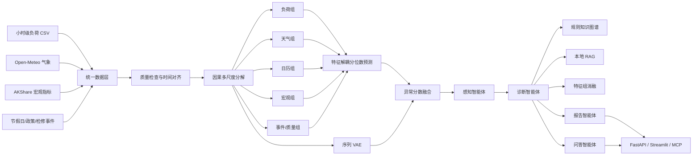

# 基于特征解耦与知识增强的“电力看经济”智能体

本仓库实现了一套可直接运行的研究与软件原型，覆盖：

**多源数据获取 → 数据质量检查 → 因果多尺度特征解耦 → 分位数负荷预测 → VAE 异常检测 → 知识图谱与 RAG 归因 → 多智能体协同 → 报告生成、问答、API、MCP 与可视化界面。**

默认演示不需要联网、不需要大模型 API Key。仓库内附两年小时级合成数据、已训练模型、检测结果和样例报告，可先验证全流程，再替换为实际电网数据。

> 重要边界：演示数据是带有明确因果结构和异常标签的合成数据，不是实测电网数据。系统能够完整运行，但真实业务精度必须在本地数据上重新训练、校准和验收；“电力变化”不能自动等同于“经济因果变化”。

## 1. 系统能力

| 模块 | 实现内容 | 主要输出 |
|---|---|---|
| 数据层 | 负荷 CSV、Open-Meteo 历史气象、AKShare 宏观数据、节假日与自定义事件 | 统一小时级宽表、质量报告 |
| 特征层 | 过去信息限定的趋势/日周期/周周期/残差分解，天气、日历、宏观、事件分组 | 39 个特征、5 个显式特征组 |
| 预测层 | 多分支特征解耦网络、动态门控、P10/P50/P90 多步预测 | 24 小时区间预测、门控权重 |
| 异常层 | 预测偏差与序列 VAE 重构误差融合，验证集无监督校准 | 异常分数、阈值、严重度、代表性事件 |
| 经济感知 | 月度负荷特征聚合 + Ridge nowcast | 工业增加值同比等指标的月度估计 |
| 诊断层 | 特征组消融、知识规则、知识图谱路径、本地 RAG | 原因候选、证据、反证、不确定性 |
| 智能体层 | 感知、诊断、报告、问答四智能体 + 编排器 | 从数据到结论的闭环 |
| 服务层 | CLI、FastAPI、Streamlit、MCP | REST API、软件原型、外部智能体工具 |

## 2. 架构



## 3. 最快启动

### Linux / macOS

```bash
cd power_econ_agent
python3 -m venv .venv
source .venv/bin/activate
python -m pip install --upgrade pip
pip install -e .

# 使用仓库内已训练模型检查全部链路
power-econ doctor -c configs/demo.yaml
python scripts/verify_all.py --config configs/demo.yaml

# 从头运行数据、特征、训练、异常、诊断、报告和问答
power-econ demo -c configs/demo.yaml
```

### Windows PowerShell

```powershell
cd power_econ_agent
py -3.11 -m venv .venv
.\.venv\Scripts\Activate.ps1
python -m pip install --upgrade pip
pip install -e .
power-econ doctor -c configs/demo.yaml
python scripts\verify_all.py --config configs\demo.yaml
power-econ demo -c configs\demo.yaml
```

Python 要求：**3.11–3.13**。CPU 即可运行演示；CUDA 可自动启用。

## 4. 常用命令

```bash
# 1) 获取/生成并校验数据
power-econ collect -c configs/demo.yaml --refresh

# 2) 构建因果特征
power-econ features -c configs/demo.yaml

# 3) 训练预测、VAE 和 nowcast 模型
power-econ train -c configs/demo.yaml

# 4) 扫描异常
power-econ scan -c configs/demo.yaml --start 2024-05-01 --end 2024-05-10 --limit 10

# 5) 诊断事件；EVENT_ID 来自 scan 输出
power-econ diagnose EVENT_ID -c configs/demo.yaml

# 6) 生成报告
power-econ report 2024-05-01 2024-05-10 -c configs/demo.yaml --max-diagnoses 5

# 7) 问答
power-econ chat "最近异常是否能够说明经济走弱？" -c configs/demo.yaml

# 8) 最新 24 小时分位数预测
power-econ forecast -c configs/demo.yaml
```

## 5. 启动 API、界面和 MCP

### FastAPI

```bash
power-econ serve -c configs/demo.yaml --host 0.0.0.0 --port 8000
```

启动后可打开：

- API 文档：`http://127.0.0.1:8000/docs`
- 健康检查：`http://127.0.0.1:8000/health`

### Streamlit 软件原型

```bash
pip install -e ".[ui]"
power-econ dashboard -c configs/demo.yaml
```

### MCP 工具服务器

```bash
pip install -e ".[mcp]"
power-econ mcp -c configs/demo.yaml --transport stdio
```

MCP 配置样例见 `examples/mcp_client_config.json`。

## 6. 使用 OpenAI 生成更自然的诊断、报告和回答

模板生成器默认可离线运行。启用 OpenAI 时：

```bash
pip install -e ".[llm]"
export OPENAI_API_KEY="你的密钥"
export POWER_ECON_LLM_PROVIDER=openai
export POWER_ECON_OPENAI_MODEL=gpt-5.6-luna
power-econ chat "分析最近一个月的经济信号" -c configs/demo.yaml
```

Windows PowerShell：

```powershell
$env:OPENAI_API_KEY="你的密钥"
$env:POWER_ECON_LLM_PROVIDER="openai"
$env:POWER_ECON_OPENAI_MODEL="gpt-5.6-luna"
```

OpenAI 接口仅负责在结构化证据基础上组织语言。异常分数、特征消融、知识规则和经济指标计算均在本地完成，不依赖大模型猜测。

## 7. 替换为真实数据

### 最少必需负荷文件

复制模板：

```bash
cp data/input/load_template.csv data/input/load.csv
cp data/input/events_template.csv data/input/events.csv
```

`data/input/load.csv` 最少包含：

```csv
timestamp,load_mw
2024-01-01 00:00:00,1280.5
2024-01-01 01:00:00,1241.2
```

推荐额外提供：`region`、`sensor_quality`、行业/区域分项负荷等字段。时间戳按配置中的 `Asia/Shanghai` 解释。

随后编辑 `configs/real_data.yaml` 中的区域、经纬度和数据路径：

```bash
pip install -e ".[real-data]"
power-econ collect -c configs/real_data.yaml --refresh
power-econ features -c configs/real_data.yaml
power-econ train -c configs/real_data.yaml
python scripts/verify_all.py --config configs/real_data.yaml
```

不希望联网时，使用 `configs/csv_data.yaml`，将负荷、气象、宏观和事件全部改为本地 CSV。完整字段规范见 `docs/真实数据接入规范.md`。

## 8. 已验证的演示结果

仓库内默认两年小时级合成数据共 **17,544 行**。当前随附模型在时间顺序测试集上的结果：

| 指标 | 结果 |
|---|---:|
| 负荷预测 MAE | 41.046 MW |
| 负荷预测 RMSE | 59.358 MW |
| 负荷预测 MAPE | 3.138% |
| 相对周季节朴素基线 MAE 改善 | 7.341% |
| 80% 预测区间覆盖率 | 0.770 |
| 异常 ROC-AUC | 0.985 |
| 异常 Average Precision | 0.721 |
| 异常召回率 | 0.943 |
| 工业指标 nowcast R² | 0.613 |
| 工业指标 nowcast 相关系数 | 0.825 |

这些指标只用于证明工程链路、训练与评估可复现；不能代表实际地区电网性能。详细结果见 `docs/DEMO_VALIDATION.md` 和 `artifacts/outputs/training_summary.json`。

## 9. 目录结构

```text
power_econ_agent/
├── configs/                  # 演示、研究、真实数据与 CSV 配置
├── data/
│   ├── input/                # 用户输入模板
│   ├── raw/                  # 统一后的原始数据
│   └── processed/            # 模型特征与特征规范
├── knowledge/
│   ├── domain_knowledge.yaml # 可执行原因规则与图谱边
│   └── docs/                 # 本地 RAG 文档
├── src/power_econ/
│   ├── data/                 # 数据获取与校验
│   ├── features/             # 因果分解和特征分组
│   ├── models/               # 预测、VAE、nowcast、推理
│   ├── knowledge/            # 图谱与本地检索
│   ├── llm/                  # 离线模板/OpenAI 结构化输出
│   ├── agents/               # 四智能体和编排器
│   └── api/                  # FastAPI
├── artifacts/                # 模型、校准、结果、报告和 SQLite
├── scripts/                  # 一键运行与验收脚本
├── tests/                    # 单元及端到端测试
├── notebooks/                # 交互式完整流程
└── docs/                     # 完整操作与算法说明
```

## 10. 关键设计保证

1. **防止时间泄漏**：训练/验证/测试按时间顺序划分；趋势和周期特征只使用当前时刻之前的数据；宏观特征按发布滞后月数平移。
2. **解释不等同于因果**：系统输出原因候选、证据和不确定性，不把相关性自动写成已确认因果。
3. **异常校准不使用测试标签**：阈值仅在验证期的无监督分数组合上确定；测试标签只用于最终评估。
4. **结果可追溯**：事件、诊断、报告和会话写入 SQLite；报告保留事件编号和模型版本。
5. **无大模型也可运行**：默认模板提供器保证数据、模型、诊断、报告和问答全部可离线复现。

## 11. 测试

```bash
pip install -e ".[dev]"
pytest
python -m compileall -q src tests
python scripts/verify_all.py --config configs/demo.yaml
```

## 12. 详细文档

- [交付说明](交付说明.md)
- [完整操作教程](docs/完整操作教程.md)
- [架构与算法说明](docs/架构与算法说明.md)
- [真实数据接入规范](docs/真实数据接入规范.md)
- [API 与 MCP 使用](docs/API与MCP使用.md)
- [验收清单](docs/验收清单.md)
- [演示验证报告](docs/DEMO_VALIDATION.md)
- [已验证环境](docs/已验证环境.md)
- [常见问题](docs/常见问题.md)
- [与开题 PPT 对应关系](docs/与开题PPT对应关系.md)

## 13. 参考接口

- Open-Meteo Historical Weather API：`https://open-meteo.com/en/docs/historical-weather-api`
- AKShare 宏观数据文档：`https://akshare.akfamily.xyz/data/macro/macro.html`
- OpenAI Responses API：`https://developers.openai.com/api/reference/resources/responses/methods/create`
- MCP Python SDK：`https://py.sdk.modelcontextprotocol.io/`

## 14. 许可证

MIT，见 `LICENSE`。
