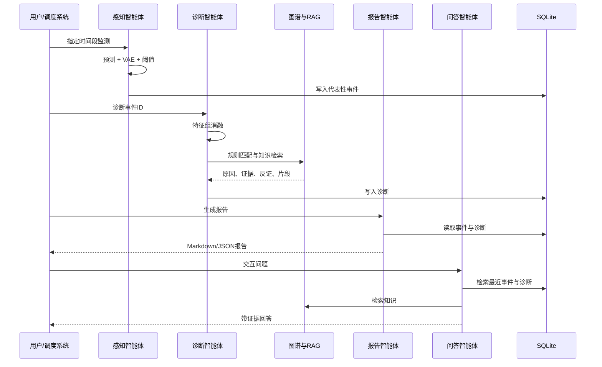

# 架构与算法说明

## 1. 目标映射

本实现把项目目标拆成四个可独立测试、又可协同运行的智能体：

| 研究目标 | 工程模块 | 验证方式 |
|---|---|---|
| 多源数据理解与异常识别 | 数据层、FeatureBuilder、Forecaster、VAE、PerceptionAgent | 预测指标、异常指标、事件列表 |
| 知识增强原因分析 | 特征组消融、DomainKnowledgeGraph、LocalKnowledgeBase、DiagnosisAgent | Top-k 原因、证据、反证、人工复核标记 |
| 自动报告与问答 | ReportAgent、QAAgent、模板/OpenAI Provider | Markdown/JSON 报告、带证据回答 |
| 多智能体闭环 | PowerEconomyOrchestrator、SQLite、API、MCP | 一键 demo、端到端测试、服务接口 |

## 2. 分层架构

```text
┌────────────────────────────────────────────────────────────┐
│ 交互层：CLI / FastAPI / Streamlit / MCP                    │
├────────────────────────────────────────────────────────────┤
│ 智能体层：感知 / 诊断 / 报告 / 问答 / 编排                  │
├────────────────────────────────────────────────────────────┤
│ 知识层：规则图谱 / 本地 RAG / 模板或 OpenAI 结构化生成      │
├────────────────────────────────────────────────────────────┤
│ 模型层：分位数预测 / VAE / 异常校准 / 经济 nowcast          │
├────────────────────────────────────────────────────────────┤
│ 特征层：因果趋势 / 日周期 / 周周期 / 五组显式特征            │
├────────────────────────────────────────────────────────────┤
│ 数据层：负荷 / 气象 / 宏观 / 日历 / 政策事件 / 数据质量      │
└────────────────────────────────────────────────────────────┘
```

## 3. 数据流

1. `collect_raw_data` 获取或读取各数据源；
2. 时间戳统一到配置时区，按小时对齐；
3. `validate_raw_data` 输出质量报告；
4. `FeatureBuilder` 构造过去信息限定特征；
5. `prepare_data` 进行时间切分、标准化和窗口化；
6. `DisentangledForecaster` 学习周季节基线残差的分位数；
7. `SequenceVAE` 学习多变量常态序列；
8. 验证集上校准融合异常分数；
9. `InferenceEngine` 加载落盘模型完成在线推理；
10. `PerceptionAgent` 筛选代表性事件并写库；
11. `DiagnosisAgent` 联合消融、图谱和 RAG；
12. `ReportAgent` 与 `QAAgent` 消费事件、诊断和知识证据。

## 4. 防止数据泄漏

### 4.1 因果分解

趋势通过 `load.shift(1)` 后的历史值计算。日周期和周周期使用“组内之前观测均值”，当前值被明确排除。

### 4.2 滚动统计

所有负荷滚动均值和标准差均从 `load.shift(1)` 开始。

### 4.3 宏观发布时滞

月度宏观原始值用于 nowcast 目标；预测输入使用 `*_published`，按 `release_lag_months` 平移。默认当月只能看到上月已发布值。

### 4.4 时间切分

训练、验证、测试严格按时间顺序，不随机切分。

### 4.5 异常阈值

中位数、MAD 和阈值分位数只从验证期计算。测试标签仅用于报告最终指标。

## 5. 特征解耦预测

设五组输入为 \(X_g\)，每组独立编码：

\[
h_g=f_g(X_g)
\]

组门控：

\[
\alpha_g=\frac{\exp(q(h_g))}{\sum_j\exp(q(h_j))}
\]

融合：

\[
h=\sum_g \alpha_g h_g
\]

未来步长 \(k\) 的 embedding 为 \(e_k\)，解码：

\[
r_{k}=d([h;e_k])
\]

令 `raw=(m,a,b)`，有：

\[
P50=m,\quad P10=m-softplus(a),\quad P90=m+softplus(b)
\]

保证分位数有序。

## 6. 解耦正则

将各组上下文归一化并计算 Gram 矩阵：

\[
G_{ij}=\frac{h_i^Th_j}{||h_i||||h_j||}
\]

正则项：

\[
\mathcal L_{orth}=||G-I||_F^2
\]

其作用不是保证统计独立，而是减少不同分支表示完全重合，提升组级解释的可用性。

## 7. 分位数损失

对分位数 \(q\)：

\[
\rho_q(u)=max(qu,(q-1)u),\quad u=y-\hat y_q
\]

三分位平均形成 `quantile_loss`。区间宽度来自数据而非固定误差常数。

## 8. 序列 VAE

编码器：GRU → \(\mu,\log\sigma^2\)。训练时重参数采样，推理时使用 \(\mu\) 保证稳定。

重构误差用于检测“多变量模式异常”，例如：

- 负荷变化与天气不匹配；
- 传感器质量突降；
- 政策事件下出现特殊负荷形态；
- 残差和波动联合异常。

VAE 不是单独的最终判定器，而是与预测残差融合。

## 9. 异常检测

预测原始分数使用残差除以预测区间半宽；VAE 使用均方重构误差。二者在验证期做稳健尺度归一化后加权。

严重度由 `score / threshold` 决定：

| 比值 | 严重度 |
|---:|---|
| < 1.25 | low |
| 1.25–1.75 | medium |
| 1.75–2.5 | high |
| ≥ 2.5 | critical |

事件筛选会在 `min_separation_hours` 邻域内只保留最高分点，避免同一事件产生大量重复告警。

## 10. 解释机制

### 10.1 动态门控

门控说明模型在当前窗口对各数据组的依赖程度，但不直接等于因果贡献。

### 10.2 组消融

将某组特征替换为训练均值，计算预测变化。它反映模型局部敏感性，语义比逐变量解释稳定。

### 10.3 知识规则

规则把观测上下文转换为候选原因、证据和反证，并通过图谱边返回相关实体。

### 10.4 RAG

检索到的知识片段用于约束表述、提醒风险和提供业务解释，不参与异常分数计算。

### 10.5 大模型

大模型只接收结构化事件、候选原因、特征贡献和知识片段；系统提示要求不得添加输入外事实、不得把相关性写成因果。

## 11. 多智能体协作



## 12. 持久化

SQLite 表保存：

- 异常事件；
- 诊断结果；
- 报告元数据与正文；
- 会话消息。

事件 ID 由“区域 + 时间戳”生成稳定哈希，同一事件重复扫描不会产生无限重复记录。

## 13. nowcast 的定位

nowcast 用于把高频负荷特征映射到低频宏观指标，是“经济信号估计”，不是官方统计替代品。真实使用应：

- 使用发布日期切分；
- 做滚动起点回测；
- 加入行业分项和当地价格；
- 与官方公布值保留版本差异；
- 输出置信区间和修订记录。

## 14. 可替换组件

| 组件 | 默认实现 | 可替换方案 |
|---|---|---|
| 预测编码器 | 多尺度统计 MLP | TCN、TFT、PatchTST、TimesNet |
| 异常模型 | GRU-VAE | USAD、DAGMM、Isolation Forest、深度 SVDD |
| 知识检索 | TF-IDF | BM25、Embedding + FAISS/Milvus |
| 图谱 | YAML + NetworkX | Neo4j、NebulaGraph、RDF |
| 生成器 | 模板/OpenAI | 其他支持结构化输出的 LLM |
| 编排 | Python Orchestrator | LangGraph、Agents SDK、自研工作流 |
| 持久化 | SQLite | PostgreSQL、TimescaleDB、ClickHouse |

默认方案强调依赖少、可复现和本地可运行；研究升级不需要推翻数据和智能体接口。
